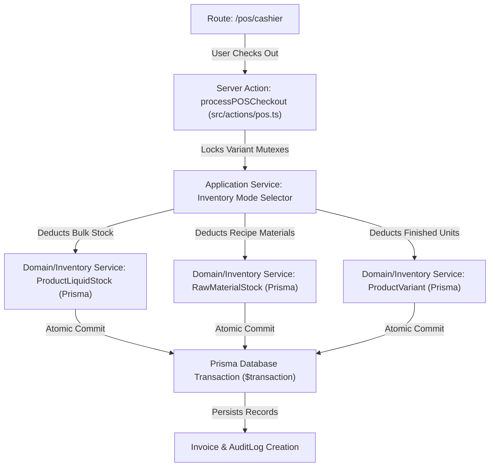
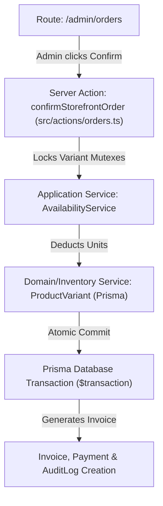

# ACTUAL SERVICE CALL GRAPH

This report documents the official call-chain mappings across storefront, POS, and admin boundaries.

---

## 1. POS Cashier Sale Call-Chain

### Call Mappings
- **Route/Page**: `/pos/cashier`
- **Server Action/Handler**: `processPOSCheckout` (in [pos.ts](file:///home/moayad/Desktop/main%20avtivity/dahab-perfumes/src/actions/pos.ts))
- **Application Service**: Mutex serialization check + role authorization validator.
- **Domain/Inventory Service**: Three-mode stock deduction engine (Finished, Bulk Liquid, Formula Raw materials).
- **Prisma Transaction**: `prisma.$transaction` block executing atomic variant stock updates, invoice generation, payment records, and audit log entries.

---

## 2. Storefront Order Confirmation Call-Chain

### Call Mappings
- **Route/Page**: `/admin/orders` or checkout completion path.
- **Server Action/Handler**: `confirmStorefrontOrder` (in [orders.ts](file:///home/moayad/Desktop/main%20avtivity/dahab-perfumes/src/actions/orders.ts))
- **Application Service**: Availability check and inventory reservation.
- **Domain/Inventory Service**: `ProductVariant` stock deduction.
- **Prisma Transaction**: `prisma.$transaction` block creating Sale, Invoice, and updating stock values atomically.
